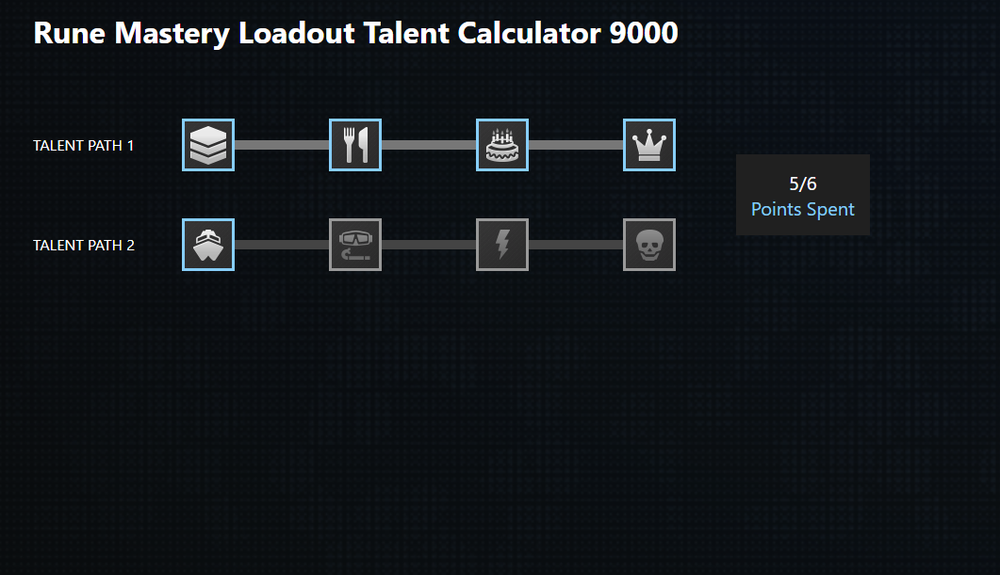
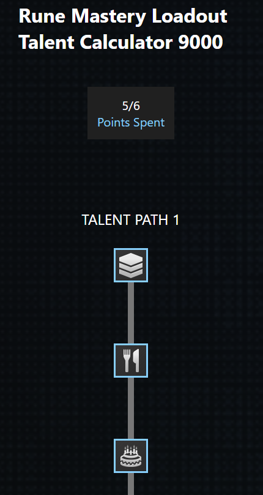

# TitanStar Legends Rune Mastery Loadout Talent Calculator 9000
Application that displays a set of talents for a user and allows the user to spec and respec. Talents must be selected in order on a specific path and a maximum of 6 talents can be selected. In mobile form factors, talent trees are displayed vertically to provide a better experience. Added simplified testing for components & more robust testing for the operations that manipulate the state of the talent tree.

## Technologies
- [React](https://reactjs.org/)
- [Typescript](https://www.typescriptlang.org/)
- [Create React App](https://github.com/facebook/create-react-app) (See "Development Guide").
- [Sass](https://sass-lang.com/)

## Development Guide
This project was bootstrapped with [Create React App](https://github.com/facebook/create-react-app).

In the project directory, you can run:

### `npm start`

Runs the app in the development mode.\
Open [http://localhost:3000](http://localhost:3000) to view it in the browser.

The page will reload if you make edits.\
You will also see any lint errors in the console.

### `npm test`

Launches the test runner in the interactive watch mode.\
See the section about [running tests](https://facebook.github.io/create-react-app/docs/running-tests) for more information.

### `npm run build`

Builds the app for production to the `build` folder.\
It correctly bundles React in production mode and optimizes the build for the best performance.

The build is minified and the filenames include the hashes.\
Your app is ready to be deployed!

See the section about [deployment](https://facebook.github.io/create-react-app/docs/deployment) for more information.

## Demos
### Desktop

### Mobile

